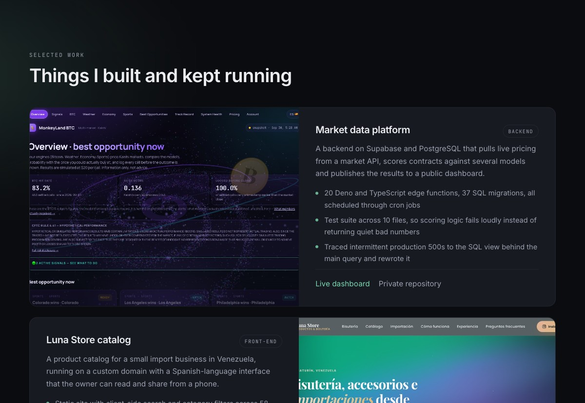

# reynaldonikola.github.io

My portfolio. Hand-written HTML, CSS and JavaScript, no framework and no build step.



**Live site:** https://reynaldonikola.github.io

## What it lists

- Market data platform: Supabase, PostgreSQL, Deno edge functions, scheduled jobs
- Luna Store catalog: static catalog with client-side search and filters
- Summit Trails, Rottweiler World and a visitor registration form: front-end coursework, rebuilt in 2026
- Content automation pipeline: Python and n8n

## How it is built

A design system in CSS custom properties, CSS Grid for the project cards, `IntersectionObserver` for scroll reveals, and a nav link that tracks the section on screen. Light and dark both defined; animations turn off under `prefers-reduced-motion`.

```
index.html
css/main.css
js/main.js
images/
```
